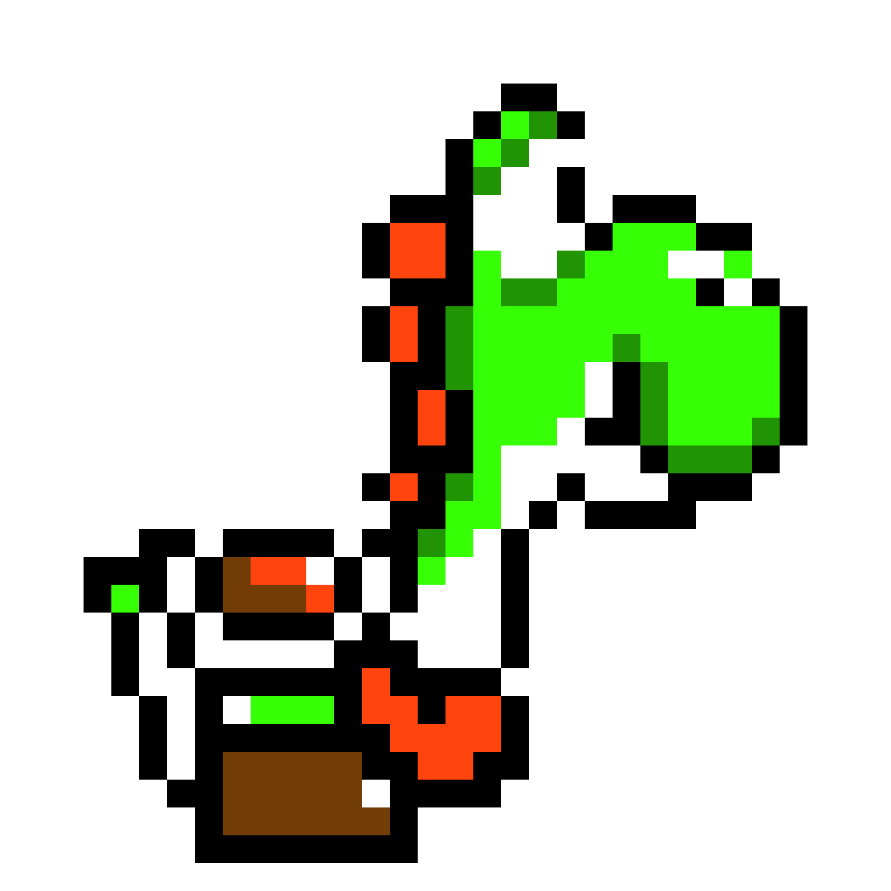
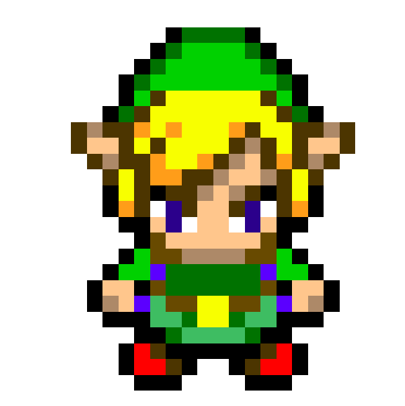
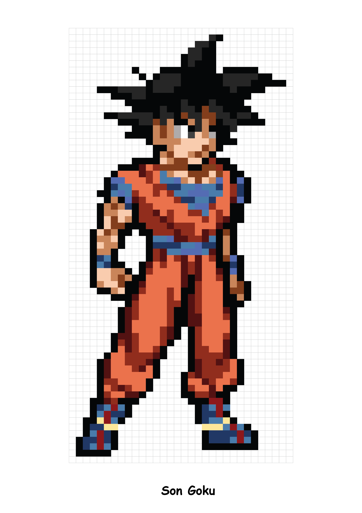

<h1 align="center">VeraxShield</h1>

  
  
  
  
  

## Description
VeraxShield est une application web avancée développée avec Blazor, représentant la partie administration de notre projet plus large, [Verax](https://codefirst.iut.uca.fr/git/Verax/Verax). Conçue pour offrir une interface de gestion intuitive, VeraxShield permet aux administrateurs de gérer efficacement les différents aspects du système Verax.

### Fonctionnalités Clés
- **Gestion des Utilisateurs** : Permet aux administrateurs de créer, modifier et supprimer des comptes utilisateurs. Inclut la gestion des rôles et des permissions pour un contrôle d'accès granulaire.
- **Notifications et Suivis des Actions** : Envoie des notifications sur les différentes actions des modérateurs afin pour assurer une meilleure gestion du système.

### Objectif du Projet
L'objectif principal de VeraxShield est de fournir une plateforme centralisée pour la gestion et le contrôle administratif du système Verax, en rationalisant les processus administratifs et en offrant une vue d'ensemble claire des opérations.

## Installation et Configuration
1. Clonez le dépôt : `git clone (https://codefirst.iut.uca.fr/git/Verax/Blazor_SAE.git)`
2. Ouvrez le fichier `VeraxShield.sln` avec Visual Studio.
3. Restaurez les packages nécessaires.
4. Lancez le projet depuis Visual Studio.

<h2 align="center">Equipe de Développement</h2>

